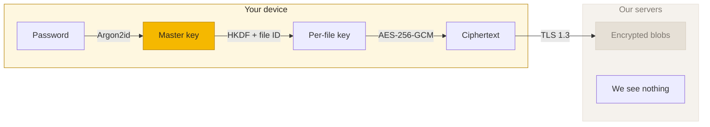

  

<h3 align="center">Storage that can't be read — not even by us.</h3>

  End-to-end encrypted cloud storage. Zero-knowledge by architecture. 
  Built in Europe. Governed by EU law. Open source.

  
  &nbsp;
  

  <a href="https://beebeeb.io">Website</a> &nbsp;·&nbsp; <a href="https://beebeeb.io/security">Security</a> &nbsp;·&nbsp; <a href="https://beebeeb.io/docs">Docs</a> &nbsp;·&nbsp; <a href="https://beebeeb.io/pricing">Pricing</a>

---

### What we build

Beebeeb encrypts your files **on your device** before they leave it. Our servers store opaque ciphertext blobs — we can't read your data, we can't read your filenames, and we can't help you if you lose your recovery phrase. That's the point.

Every client app is open source. Read the code, compile it yourself, audit our cryptography. We earn trust — we don't ask for it.

### Repositories

| Repository | What it does | Language |
|------------|-------------|----------|
| **[core](https://github.com/beebeeb-io/core)** | Cryptographic core — AES-256-GCM, Argon2id, HKDF, BIP39 recovery, sync engine, WASM bindings | Rust |
| **[web](https://github.com/beebeeb-io/web)** | Web client — encrypted file management in your browser | TypeScript |
| **[cli](https://github.com/beebeeb-io/cli)** | `bb` — your vault from the terminal | Rust |
| **[mobile](https://github.com/beebeeb-io/mobile)** | iOS and Android app | TypeScript |
| **[desktop](https://github.com/beebeeb-io/desktop)** | Desktop sync for macOS, Windows, and Linux | Swift / Rust |
| **[site](https://github.com/beebeeb-io/site)** | The beebeeb.io website | Astro |
| **[rclone-backend](https://github.com/beebeeb-io/rclone-backend)** | Rclone backend — mount your vault as a drive | Go |

### How the encryption works

No backdoors. No key escrow. No master decryption capability. If we are subpoenaed, we hand over encrypted garbage — and that's by design.

### The four promises

1. **Zero-knowledge** — We will never add a backdoor, key escrow, or decryption capability.
2. **EU-only infrastructure** — stored in Falkenstein, Germany, under EU law. No US subprocessors.
3. **No telemetry** — No analytics SDKs, no crash reports unless you opt in.
4. **Acquired? Open-sourced** — If we're ever acquired or shut down, all client apps become public domain within 30 days.

### Who we are

Two brothers from Wijchen, Netherlands. We built the storage product every European SMB needs but nobody was making honestly.

**Initlabs B.V.** · KvK 95157565 · Wijchen, Netherlands · Bootstrapped

---

  <a href="https://beebeeb.io/bug-bounty">Bug bounty</a> &nbsp;·&nbsp; <a href="https://status.beebeeb.io">Status</a> &nbsp;·&nbsp; <a href="mailto:contact@beebeeb.io">Contact</a>

